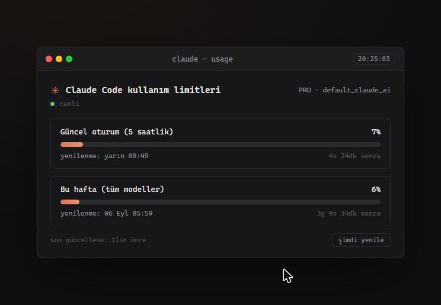

<div align="center">

# ✳️ Claude Limits

**Claude Code kullanım limitlerini (5 saatlik oturum ve haftalık) canlı takip eden yerel panel**

[](https://github.com/mer4t/mer4t-claude-limits/releases/latest)
[](#)
[](https://nodejs.org/)
[](https://nodejs.org/api/single-executable-applications.html)



</div>

---

## Nedir bu?

Claude Code'un kendi `/usage` komutunun gösterdiği verileri — 5 saatlik oturum limiti ve haftalık limitler (tüm modeller, Opus, Sonnet, bağlı uygulamalar) — sürekli açık kalan küçük bir masaüstü penceresinde canlı gösteren yerel bir panel. Terminale benzer koyu bir tema kullanır; her limitin yüzde durumunu, ne zaman sıfırlanacağını (hem saat hem canlı geri sayım olarak) gösterir.

Claude Code ile aynı uç noktayı (`api.anthropic.com/api/oauth/usage`) makinenizdeki oturum jetonuyla sorgular; jeton hiçbir zaman ağ üzerinden başka bir yere gönderilmez. Windows ve macOS'ta çalışır.

**Güncel sürüm:** `v1.1.0` — sürüm geçmişi için [CHANGELOG.md](CHANGELOG.md) dosyasına bakabilirsiniz.

> 🧩 **VS Code eklentisi de var:** Aynı verileri VS Code durum çubuğunda ve bir panelde gösteren eklenti [`vscode-extension/`](vscode-extension/) klasöründe (İngilizce + Türkçe, Windows/macOS/Linux).

## ✨ Özellikler

| | |
|---|---|
| 📊 **Canlı limit takibi** | Güncel oturum (5 saatlik) + haftalık limitler (tüm modeller, Opus, Sonnet, bağlı uygulamalar) |
| ⏱️ **Çift zaman gösterimi** | Her limit için hem yenilenme saati ("yarın 00:49") hem canlı geri sayım ("4s 24dk sonra") |
| 🔁 **Otomatik yenileme** | 20 saniyede bir; hata durumunda 5 dakikaya kadar otomatik geri çekilir, başarılı istekte sıfırlanır |
| 🛡️ **Hataya dayanıklı** | Bağlantı koptuğunda son bilinen veriler ekranda kalır, ham hata yerine anlaşılır Türkçe mesaj gösterilir |
| 🪟 **Bağımsız uygulama penceresi** | Chrome/Edge (macOS'ta ayrıca Brave/Chromium) varsa adres çubuğu/sekmesiz `--app` penceresi; hiçbiri yoksa varsayılan tarayıcıda sekme |
| 🙈 **Sessiz çalışma** | Çift tıklandığında arka planda konsol/Terminal penceresi açılmaz; pencere kapatılınca sunucu süreci de otomatik sonlanır |
| 📦 **Tek dosya, taşınabilir** | Node'un Single Executable Application özelliğiyle tek bir `.exe` (Windows) veya `.app` (macOS); kurulum, ek bağımlılık veya yönetici izni gerekmez |
| 🔒 **Gizlilik** | Hiçbir üçüncü taraf servise veri gitmez; tek ağ isteği doğrudan `api.anthropic.com`'a. Yerel sunucu yalnızca `127.0.0.1`'i dinler, ağdaki diğer cihazlar erişemez |

## 🚀 Kurulum

### Windows

1. [Releases](https://github.com/mer4t/mer4t-claude-limits/releases/latest) sayfasından `ClaudeLimits.exe` dosyasını indirin.
2. İstediğiniz bir klasöre kopyalayın (kurulum gerekmez).
3. Çift tıklayın — Chrome veya Edge varsa bağımsız bir uygulama penceresi açılır.

> Uygulama dijital olarak imzalanmamıştır. İlk çalıştırmada Windows SmartScreen bir uyarı gösterebilir; "Ek bilgi" → "Yine de çalıştır" ile devam edebilirsiniz.

### macOS

1. [Releases](https://github.com/mer4t/mer4t-claude-limits/releases/latest) sayfasından `ClaudeLimits.app` paketini indirin ve `Uygulamalar` klasörüne taşıyın.
2. İlk açılışta sağ tık → **Aç** deyin (uygulama imzasız olduğu için Gatekeeper uyarı verir).
3. macOS, Claude Code'un Keychain kaydına erişim izni isteyecektir; **Her Zaman İzin Ver** seçerseniz bir daha sormaz.

> Uygulama Apple tarafından notarize edilmemiştir; Gatekeeper uyarısı bu yüzdendir.

### Ön koşul

Panelin veri gösterebilmesi için Claude Code ile makinenizde **en az bir kez** giriş yapmış olmanız gerekir. Windows'ta jeton `~/.claude/.credentials.json` dosyasından, macOS'ta Claude Code'un Keychain'e yazdığı `Claude Code-credentials` kaydından okunur (Keychain'de yoksa dosyaya bakılır). Panel jetonu her sorguda yeniden okur; Claude Code kendi jetonunu yeniledikçe panel de otomatik güncel jetonu kullanır. Jeton yenileme işlemini panel **yapmaz** — bu, Claude Code'un kendi refresh token rotasyonunu bozabilir.

## 💻 Sistem Gereksinimleri

- Windows 10/11 veya macOS 11 (Big Sur) ve üzeri
- Chrome veya Edge (macOS'ta Brave/Chromium da olur) — bağımsız pencere modu için önerilir; yoksa varsayılan tarayıcıda normal sekme açılır
- Yönetici izni gerekmez

## 🛠️ Kaynak Koddan Çalıştırma

```bash
git clone https://github.com/mer4t/mer4t-claude-limits.git
cd mer4t-claude-limits
npm start
```

sonra tarayıcıda `http://localhost:4756` açın. Port, `PORT` ortam değişkeniyle değiştirilebilir.

### .exe olarak paketleme

```bash
npm run build
```

Build, üzerinde çalıştırıldığı işletim sistemi için çıktı üretir (çapraz derleme yoktur):

- **Windows:** `dist/ClaudeLimits.exe`. Build betiği exe'nin PE `Subsystem` alanını (editbin gerekmeden, doğrudan header patch ile) GUI olarak işaretler, böylece çift tıklandığında konsol penceresi açılmaz.
- **macOS:** `dist/ClaudeLimits.app`. İkili `.app` paketine konur (`LSUIElement` ile Dock'ta ayrı ikon ve Terminal penceresi olmadan çalışır) ve ad-hoc imzalanır. Dağıtılacak build'i [nodejs.org](https://nodejs.org/)'daki resmi Node ile alın; Homebrew'un Node'u dinamik kütüphanelere bağlı olduğu için başka Mac'lerde çalışmayabilir (betik bu durumda uyarır).

Her iki durumda da `server.js` ve `index.html`, Node'un [Single Executable Application](https://nodejs.org/api/single-executable-applications.html) özelliğiyle tek bir çalıştırılabilir dosyaya gömülür; ek dosyaya ihtiyaç duymaz.

## 🗂️ Proje Yapısı

```
mer4t-claude-limits/
├── server.js         # Yerel HTTP sunucu: /api/usage proxy'si + uygulama penceresi açma
├── index.html         # Panelin tüm arayüzü (HTML/CSS/JS, tek dosya)
├── build.js           # server.js + index.html -> dist/ClaudeLimits.exe / .app (Node SEA)
├── sea-config.json     # Node SEA build yapılandırması
├── vscode-extension/   # VS Code eklentisi (Marketplace: mer4t.claude-limits)
└── dist/               # Build çıktısı (git'e dahil değildir)
```

## ⚠️ Bilinen Sınırlamalar

- Build betiği (`build.js`) Windows ve macOS'u destekler; her platform kendi çıktısını kendisi üretir (Mac'te `.exe`, Windows'ta `.app` üretilemez). Kaynak koddan çalıştırma (`npm start`) her iki platformda da çalışır.
- Chromium tabanlı bir tarayıcı kurulu değilse bağımsız pencere modu kullanılamaz, panel varsayılan tarayıcıda normal bir sekmede açılır.
- `.exe` ve `.app` dijital olarak imzalanmamıştır; Windows SmartScreen ve macOS Gatekeeper ilk çalıştırmada uyarı gösterebilir.

## 📜 Sürüm Geçmişi

Ayrıntılı sürüm notları için [CHANGELOG.md](CHANGELOG.md) dosyasına bakın.

## 🤝 Katkıda Bulunma

Hata bildirimi veya öneri için lütfen bir [GitHub Issue](https://github.com/mer4t/mer4t-claude-limits/issues) açın.
